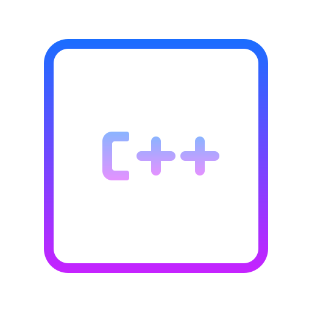
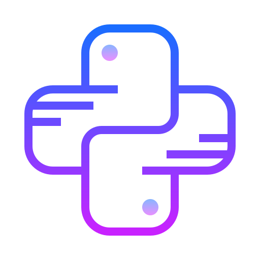
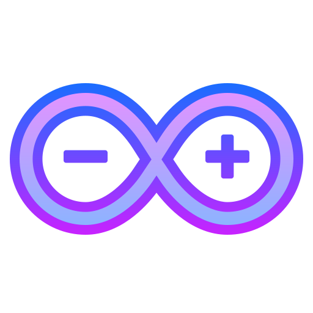
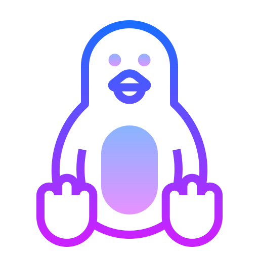
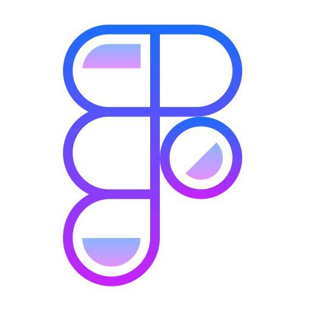
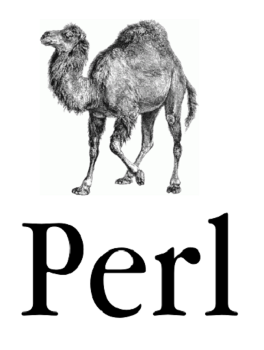
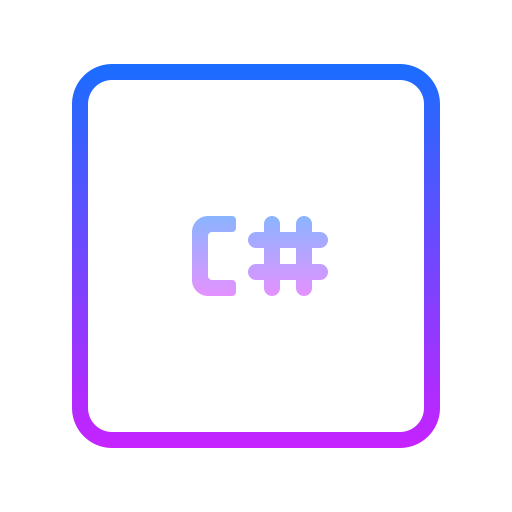
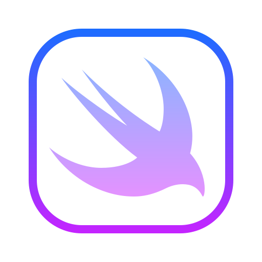
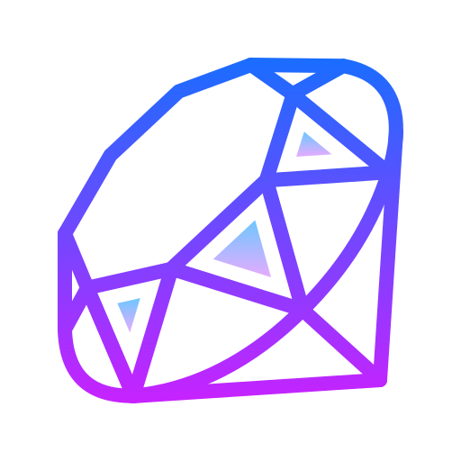

<!-- ###### HEAD ##### -->

 

  
  
  

  
  

   
 
 
  

  

  

  

<!-- ###### END OF HEAD ##### -->

<!-- ###### Languages | Tools ##### -->

 
<h4 align="center"> 
   Languages | Tools 
 </h4>
 
<code></code>
<code></code>
<code></code>
<code></code>
<code></code>

<!-- ##### WILL WORK ON THIS LATER ##### -->

<!--<code></code>-->
<!--<code></code>-->
<!--<code></code>-->
<!--<code></code>-->
<!--<code></code>--> 
<!--<code></code>-->
<!--<code></code>-->
<!--<code></code>-->
<!--<code></code>-->
<!--<code></code>-->
<!--<code></code>-->
<!--<code></code>-->
<!--<code></code>-->
<!--<code></code>-->
<!--<code></code>-->
<!--<code></code>-->
<!--<code></code>-->
<!--<code></code>-->
<!--<code></code>-->
<!--<code></code>-->
<!--<code></code>-->
<!--<code></code>-->
<!--<code></code>-->
<!--<code></code>-->
<!--<code></code>-->
<!--<code></code>-->
<!--<code></code>-->
<!--<code></code>-->
<!--<code></code>-->

<!-- ###### END OF Languages | Tools ##### -->

<!-- ###### Currently Learning ##### -->

<h4 align="left">
📖 Currently Learning 📖 
 </h4>

<code></code>
<code></code>
<code></code>
<code></code>
<code></code>
<code></code>

<!--<code></code>-->

 

<!-- ###### END OF Currently Learning ##### -->

 <!-- ###### Some of my projects ##### -->

 
 
 <h3> 🔰 Some of my projects </h3>

   

  

  

  

 

  

<!-- ###### END OF Some of my projects  ##### -->

<!-- ###### My Github Stats  ##### -->

<h4 align="center">
 My Github Stats 
</h4>
  
  
 <!--<h6 align="center"> <b>Note:</b> Top languages is only a metric of the languages my public code consists of and doesn't reflect experience or skill level.</h6>-->

 
 

<!-- ###### END OF My Github Stats  ##### -->

<!-- ###### QUOTE OF THE DAY ##### -->

<h4 align="left">
<!-- Quote Of The Day --> Fun Fact Of The Day
</h4>
<!--

-->

  

<!-- ###### END OF QUOTE OF THE DAY ##### -->

<!-- ###### SOCIAL MEDIA LINKS ##### -->

<h4 align="center">
 
 Contact 
</h4>

 
 
 

<!-- ###### END OF SOCIAL MEDIA LINKS ##### -->

<!-- ###### FOOTER ##### -->

<h4 align="center">  Support Me </h4>

- ETHEREUM =:>  0xD62aad3E3bc049002492Ee1A1D7c2c15A6Ede974

<!-- ###### END OF FOOTER ##### -->

 
